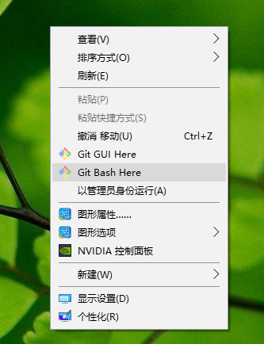
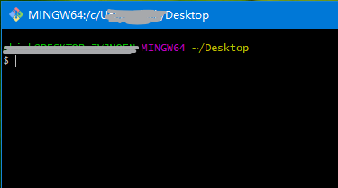
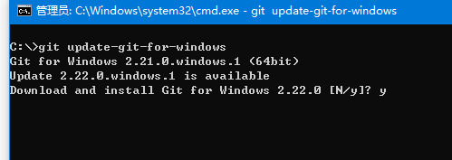

* content
{:toc}

**主要介绍版本控制工具Git的使用和常用命令，以及与之相关的GitHub的基本操作。**


## 一、版本控制
### 什么是版本控制
### 为什么需要版本控制
### 常用的版本控制工具

## 二、Git入门
强烈推荐Git官网的[教程](https://git-scm.com/book/zh/v2/)，有包含简体中文在内的各种语言翻译，并且可以下载pdf，epub，mobi形式的文档方便本地阅读。

### Git基本操作
#### 安装与配置
##### 安装
根据不同操作系统，在[官网](https://git-scm.com/downloads)下载最新版git。   Windows为例：双击下一步，，，，直到完成。  
安装完成后，右键单击，出现Git Bash Here 即表示安装成功，可以在此窗口中输入各种git命令（当然，配置好环境变量也可以直接使用Windows自带的cmd窗口）。


##### 升级
以Windows为例：  
2.17.1之前用`git update`  
2.17.1之后用`git update-git-for-windows`  

##### 配置
初次使用git，需要配置用户名和邮箱，以便后期每次提交记录提交者的信息。
```java
git config --global user.name "John Doe"
git config --global user.email johndoe@example.com
```
也可查看配置的信息
```java
git config --list
```

#### 创建仓库
##### 本地创建
```java
git init
```

##### 远程克隆
```java
git clong [url]
```
#### 文件提交
##### add
##### commit
##### push

### Git分支
#### 创建与切换分支
#### 合并分支

## 三、GitHub
[GitHub入门官网](https://guides.github.com/activities/hello-world/)  
GitHub is a code hosting platform for version control and collaboration. It lets you and others work together on projects from anywhere.


[https://git-scm.com/book/zh/v2/]: https://git-scm.com/book/zh/v2/